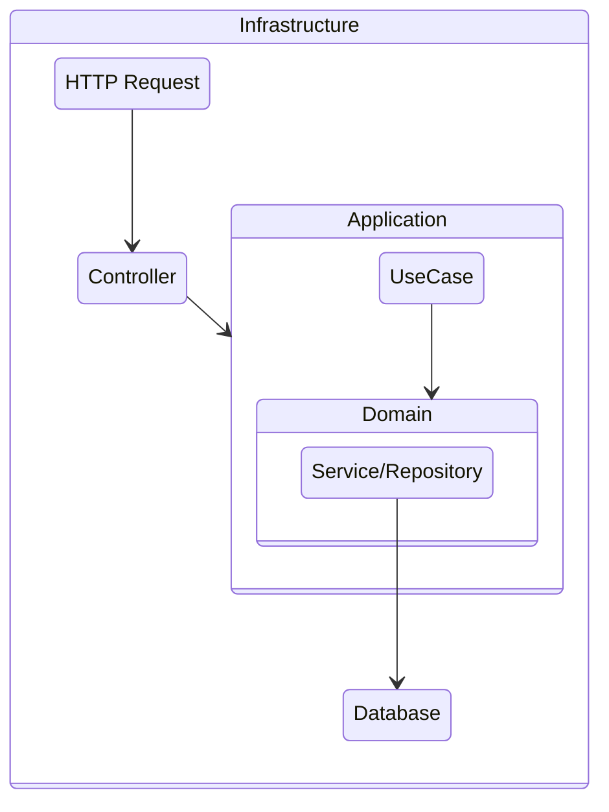

```mermaid
    stateDiagram-v2
    
    Infrastructure
    Application
    Domain
    
        State1: HTTP Request
        State2: Controller
        State3: UseCase
        State4: Service/Repository
        State5: Database

    state Infrastructure {
        State1 --> State2
        State2 --> Application
        State5
    }
    
    
    state Application {
        State3 --> Domain
    }
    
    
    state Domain {
        State4
    }
 
  State4 --> State5
```